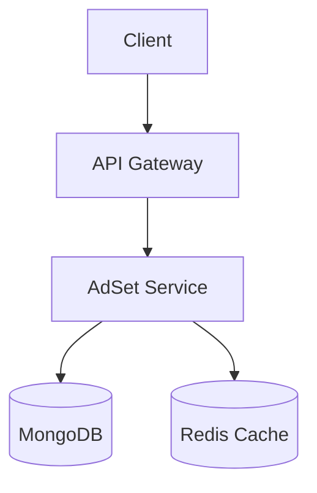

# AdSet Configuration Generator

Dynamic probabilistic adset configuration system with Redis caching and MongoDB storage.

## Features

- 🌳 Hierarchical tree structure for ad configurations
- 🎲 Probabilistic node selection with weighted distributions
- ⚡ Redis caching for fast adset generation
- 🐳 Dockerized environment with MongoDB and Redis
- 📊 Swagger API documentation
- 🔄 Automatic cache invalidation on data changes

## Tech Stack

- **Backend**: NestJS
- **Database**: MongoDB
- **Cache**: Redis
- **API Docs**: Swagger
- **Containerization**: Docker
- **Environment**: Node.js 18+

## Getting Started

### Prerequisites

- Docker 20.10+
- Node.js 18+
- npm 9+

### Installation

1. Clone the repository:
```bash
git clone https://github.com/Eann1S/adset-generation
cd adset-generation
```

2. Configure environment variables:
```bash
cp .env.example .env
```

3. Start services:
```bash
docker-compose up -d
```

4. Install dependencies:
```bash
npm install
```

5. Start the application:
```bash
npm run start:dev
```

## API Documentation

Access Swagger UI at: `http://localhost:3000/api`

## Usage Examples

### Create Node
```bash
curl -X POST http://localhost:3000/adset/node \
  -H "Content-Type: application/json" \
  -d '{
    "name": "US Node",
    "conditions": {"geo": "US"},
    "probability": 0.5,
    "parentId": "<root-id>"
  }'
```

### Generate AdSet
```bash
curl "http://localhost:3000/adset/generate?geo=US&device=mobile"
```

## Development

### Environment Variables
| Variable | Description | Default |
|----------|-------------|---------|
| `PORT` | Application port | 3000 |
| `MONGO_URI` | MongoDB connection URI | - |
| `REDIS_HOST` | Redis host | localhost |
| `REDIS_PORT` | Redis port | 6379 |

## Deployment

Production build:
```bash
docker-compose -f docker-compose.prod.yml up --build
```

## Architecture


